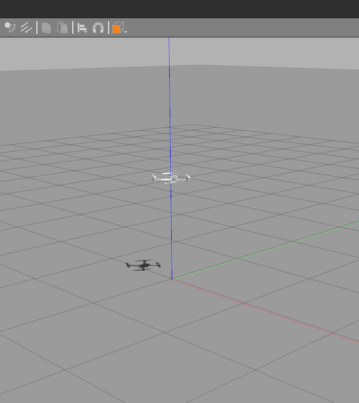

# Simulation

### Terminal 1
- Compile and source `qrotor_firmware` package
- Spawn a drone in gazebo through ros-launch
  ```
  $ source devel/setup.bash
  $ roslaunch qrotor_gazebo spawn_falcon.launch
  
  ```
  - This will launch gazebo simulator and spawn a quadrotor (named `white_falcon`) in the simulator
    
    

  - The terminal output looks something like this 

    
  - ~~It also starts a `fake` RC transmitter to the quadrotor in the simulator~~

  > :warning: **If models are not loading into gazebo**: add the models path to `GAZEBO_MODEL_PATH`; 
  > 
  > add the following to `~/.bashrc` and `source ~/.bashrc`
    
    ```
    export GAZEBO_MODEL_PATH=${GAZEBO_PLUGIN_PATH}:<path-to-ros-ws>/src/qrotor_firmware/qrotor_description/models
    export GAZEBO_PLUGIN_PATH=${GAZEBO_PLUGIN_PATH}:<path-to-ros-ws>/devel/lib
    ```

### Terminal 2

> :warning: Current version of the quadrotor gazebo plugin takes care of arm the drone upon launch, the following steps can be skipped

- Launch `rqt/Reconfigurator` in this terminal to send commands to gazebo simulator (it also contains the fake rc transmitter)
- Source the `qrotor_firmware` package & rosrun rqt reconfigure package
  ```
  $ source devel/setup.bash
  $ rosrun rqt_reconfigure rqt_reconfigure
  ```
   
  

### To launch the drone (Same process as Hardware)
1. Turn on KILL SWITCH (On the transmitter, this switch is used to KILL the drone if something goes wrong)
  
    
2. Arm the drone
  
    

    Terminal 1 should output

    

3. Switch to mode 2 (position control)
   - **0** Manual Control
   - **1** Attitude Stabilization
   - **2** Position Control or Offboard Control

    

### Terminal 3
Open a new terminal (terminal 3). Two ways to launch the drone, ONBOARD mode which makes use of onboard position control **or** OFFBOARD mode where the `thrust vector` for position control is sent to the drone as a ros message

- (ONBOARD) You can directly start using the onboard mode (after completely the previous 3 steps to arm and set the position mode) by request a takeoff ros service
   ```
   $ rosservice call /white_falcon/takeoff
   ```
   

- (OFFBOARD) Request a mode switch to offboard using ros service (and similarily turn off offboard by sending false)
  ```
  $ rosservice call /white_falcon/offboard "data: true"
  ```
  - You can control the drone using offboard mode by sending _thrust force_ using `geometry_msgs/TwistStamped` ros message using the topic name `/white_falcon/thrust_force`

    `geometry_msgs::TwistStamped::Linear` for thrust force
    
    `geometry_msgs::TwistStamped::Angular::Z` for yaw setpoint
     
Next steps: [Working with depth images](./depth.md) or [Hardware](./hardware.md)